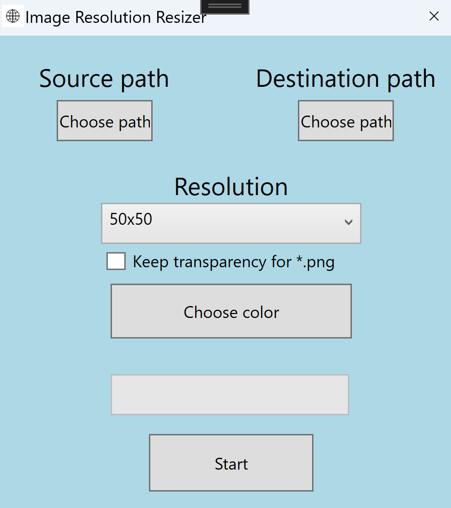

# Image resolution changer
 Application that changes the resolution of the image, makes available to change the background of the canvas if the image is transparent
 (height="400px")(width="200px")
 First of all, you need to choose your source path and destination path, then choose the new resolution from a comboBox and start the resizing of images from the folder
